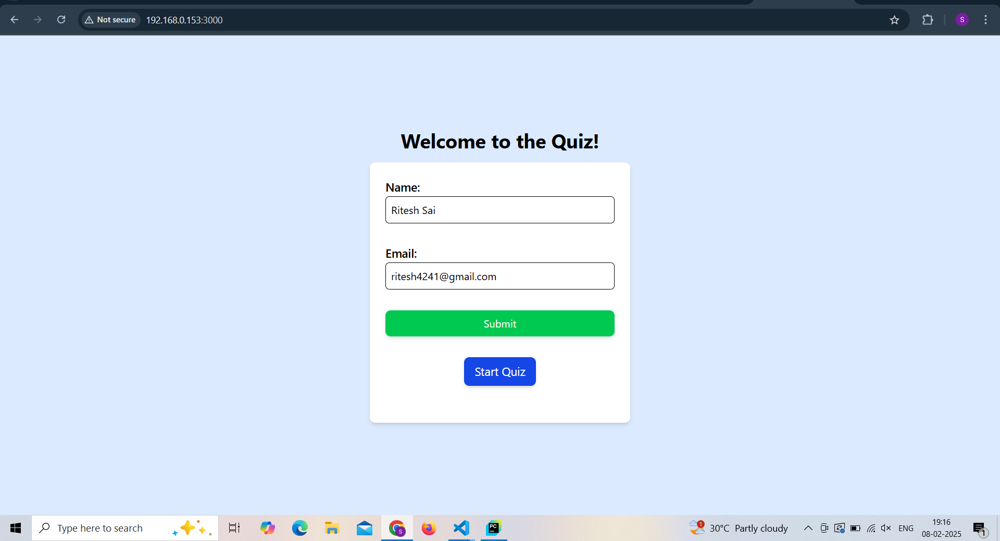
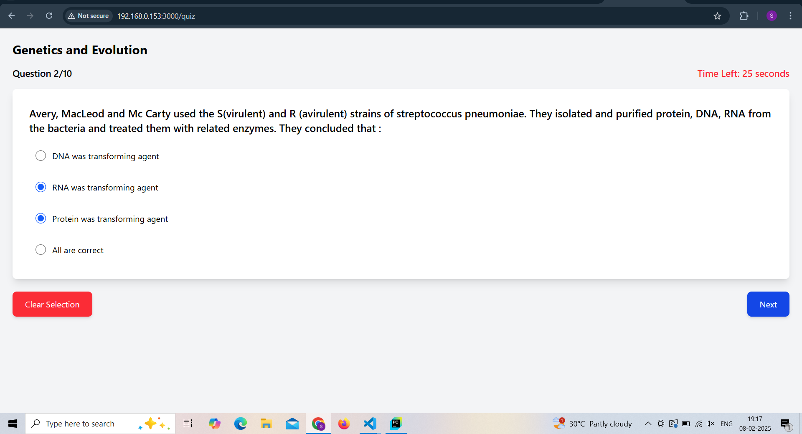
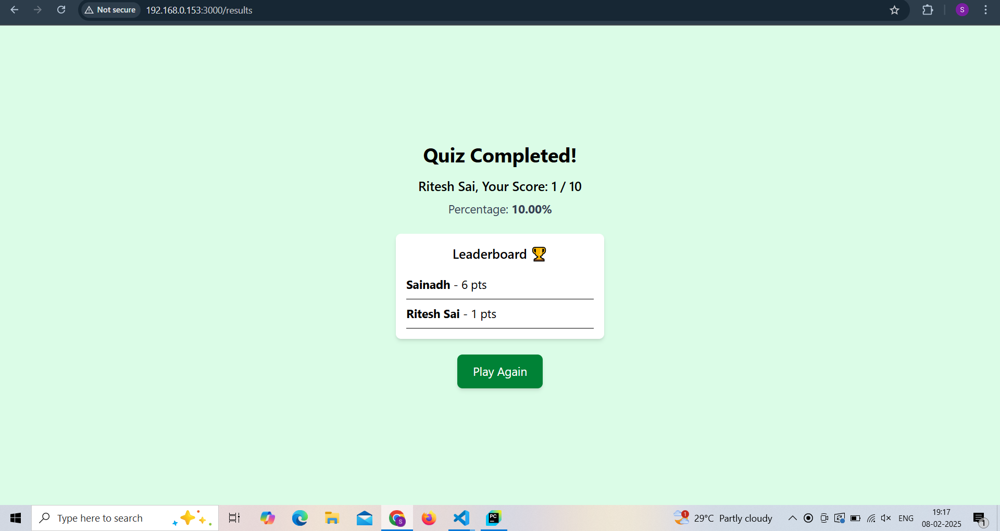

# Quiz Application with Gamification Features

## Project Overview
A web-based quiz application designed to provide an engaging and gamified experience for users. Features include a countdown timer for questions, a dynamic leaderboard, and detailed results.

## Features
-  **Multiple-Choice Questions**: Toggleable answers with clear feedback.
-  **Countdown Timer**: Keeps users engaged and adds a sense of urgency.
-  **Leaderboard**: Displays top scores to promote competition.
-  **Results Page**: Detailed summary with scores and percentages.
-  **Responsive Design**: Optimized for all screen sizes.

## Technology Stack
- **Frontend**: React, Vite, TailwindCSS
- **Backend**: No backend; uses a static API
- **Data Storage**: LocalStorage for leaderboard and user data

## Setup Instructions
### Prerequisites
Ensure you have the following installed:
- Node.js 
- npm or yarn

### Installation
1. Clone this repository:
   bash-
   git clone <repository-url>

2. Navigate to the project directory:
   cd project-folder

3. Install dependencies:
   npm install
   npm install tailwindcss
   npm install react-router-dom
   npm install axios  
   npm install express cors dotenv

4. Start the development server:
   npm run dev

5. In another terminal start the backend server:
   node server.js

## 📸 Screenshots  

A fun and interactive quiz application built with React, Tailwind, and Express.

### 🏠 Home Page  

### ❓ Quiz Page  

### 🏆 Result / Leaderboard  

## 🎥 Video Walkthrough  
[Watch Demo Video](screenshots/VideoWalkthrough.mp4)
